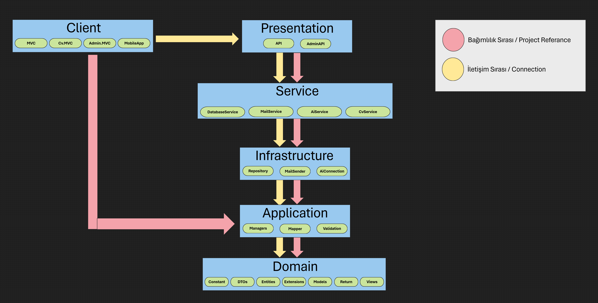

# TahaMucasiroğluBlog - Project Architecture

## Overview

TahaMucasiroğluBlog project is a blog and CV (resume) management system developed in accordance with Clean Architecture principles, adopting a layered architecture approach. The project is developed using .NET Core technology and designed adhering to SOLID principles, Domain Driven Design (DDD), and Separation of Concerns (SoC) principles.

## Architecture Diagram

## Layers and Responsibilities

### 1. Domain Layer

The Domain layer is the core layer containing the business logic and rules of the application. This layer has no external dependencies.

#### Domain Projects:

- **TahaMucasirogluBlog.Domain.Entities**
- **TahaMucasirogluBlog.Domain.DTOs**  
- **TahaMucasirogluBlog.Domain.Models**
- **TahaMucasirogluBlog.Domain.Constant**
- **TahaMucasirogluBlog.Domain.Extensions**
- **TahaMucasirogluBlog.Domain.Return**

### 2. Application Layer

The Application layer is responsible for implementing business logic and managing use cases. This layer depends on the Domain layer.

#### Application Projects:

- **TahaMucasirogluBlog.Application.Managers**
- **TahaMucasirogluBlog.Application.Mapper**
- **TahaMucasirogluBlog.Application.Validation**

### 3. Infrastructure Layer

The Infrastructure layer is responsible for communication with external systems (database, file system, web services, etc.). Repository pattern implementations are located in this layer.

#### Infrastructure Projects:

- **TahaMucasirogluBlog.Infrastructure.Repository**

### 4. Service Layer

The Service layer contains business logic services and specialized operations. This layer covers business logic shared between different modules.

#### Service Projects:

- **TahaMucasirogluBlog.Service.Database**
- **TahaMucasirogluBlog.Service.Cv**

### 5. Presentation Layer

The Presentation layer contains user interfaces and API endpoints. This layer is the part that directly interacts with users.

#### Presentation Projects:

- **TahaMucasirogluBlog.Presentation.API**

### 6. Client Layer

The Client layer contains different client applications. Web applications developed using the MVC pattern are located in this layer.

#### Client Projects:

- **TahaMucasirogluBlog.Client.TahaMucasirogluMVC** - Main blog site
- **TahaMucasirogluBlog.Client.Admin.TahaMucasirogluMVC** - Admin panel
- **TahaMucasirogluBlog.Client.Cv.TahaMucasirogluMVC** - CV/Resume site

### 7. Utils Layer

The Utils layer contains helper tools and utility applications.

#### Utils Projects:

- **TahaMucasirogluBlog.Utils.DatabaseInstallation** - Database setup and migration operations

## Technologies and Libraries

### Core Technologies:
- **.NET 8.0** - Main framework
- **Entity Framework Core** - ORM
- **SQL Server** - Database
- **ASP.NET Core MVC** - Web framework
- **ASP.NET Core Web API** - REST API

### Used Libraries:
- **AutoMapper** - Object mapping
- **FluentValidation** - Validation operations
- **Serilog** - Logging
- **Newtonsoft.Json** - JSON operations
- **JWT Bearer** - Authentication
- **Swashbuckle (Swagger)** - API documentation

## Design Patterns

- **Repository Pattern** - Data access abstraction
- **Unit of Work Pattern** - Transaction management
- **Dependency Injection** - Dependency management
- **Factory Pattern** - Object creation
- **Strategy Pattern** - Algorithm selection
- **Middleware Pattern** - Request/Response processing

## Project Structure Features

1. **Dependency Direction**: From inner layers to outer layers (Domain → Application → Infrastructure → Presentation)
2. **Testability**: Each layer can be tested independently
3. **Maintainability**: Easy maintenance thanks to loose coupling between layers
4. **Scalability**: New features can be easily added
5. **Reusability**: Common code can be shared

## Security Features

- JWT-based authentication
- Password hashing (SHA256 etc.)
- CORS policies
- Rate limiting
- Input validation
- Error handling middleware

## Logging and Monitoring

- Detailed logging with Serilog
- Different log levels (Debug, Info, Warning, Error, Fatal)
- File-based log records
- Structured logging support

## Database Structure

The project is developed with a Code-First approach. Main entities:

- **User** - User information
- **BlogPost** - Blog posts
- **Category** - Categories
- **Tag** - Tags
- **Comment** - Comments
- **Experience** - Experiences (for CV)
- **Skill** - Skills (for CV)
- **SocialLink** - Social media links
- **Info** - General information

## Deployment and Publishing

The project can be published for different environments:
- **Development** - Development environment
- **Staging** - Testing environment
- **Production** - Live environment

Separate appsettings files are available for each environment.