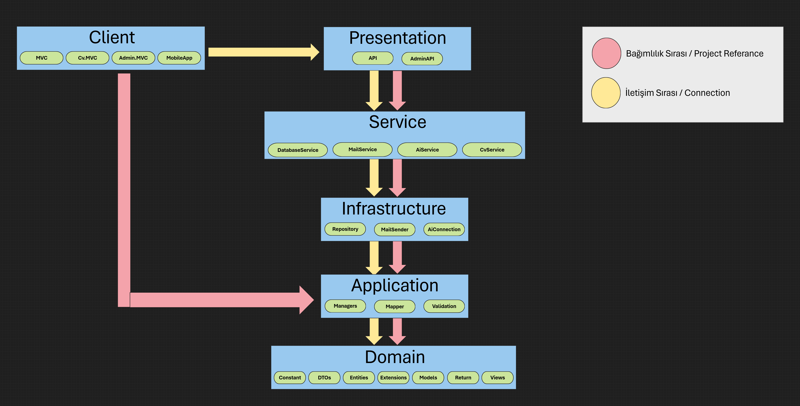

# TahaMucasiroğluBlog - Proje Mimarisi

## Genel Bakış

TahaMucasiroğluBlog projesi, Clean Architecture (Temiz Mimari) prensiplerine uygun olarak geliştirilmiş, katmanlı mimari yaklaşımını benimseyen bir blog ve CV (özgeçmiş) yönetim sistemidir. Proje, .NET Core teknolojisi kullanılarak geliştirilmiştir ve SOLID prensipleri, Domain Driven Design (DDD) ve Separation of Concerns (SoC) ilkelerine bağlı kalınarak tasarlanmıştır.

## Mimari Diyagram

## Katmanlar ve Sorumlulukları

### 1. Domain Katmanı

Domain katmanı, uygulamanın iş mantığını ve kurallarını içeren çekirdek katmandır. Bu katman hiçbir dış bağımlılığa sahip değildir.

#### Domain Projeleri:

- **TahaMucasirogluBlog.Domain.Entities**
- **TahaMucasirogluBlog.Domain.DTOs**  
- **TahaMucasirogluBlog.Domain.Models**
- **TahaMucasirogluBlog.Domain.Constant**
- **TahaMucasirogluBlog.Domain.Extensions**
- **TahaMucasirogluBlog.Domain.Return**

### 2. Application Katmanı

Application katmanı, iş mantığının uygulanması ve kullanım senaryolarının (use cases) yönetilmesinden sorumludur. Bu katman, Domain katmanına bağımlıdır.

#### Application Projeleri:

- **TahaMucasirogluBlog.Application.Managers**
- **TahaMucasirogluBlog.Application.Mapper**
- **TahaMucasirogluBlog.Application.Validation**

### 3. Infrastructure Katmanı

Infrastructure katmanı, dış sistemlerle (veritabanı, dosya sistemi, web servisleri vb.) iletişimden sorumludur. Repository pattern implementasyonları bu katmanda yer alır.

#### Infrastructure Projeleri:

- **TahaMucasirogluBlog.Infrastructure.Repository**

### 4. Service Katmanı

Service katmanı, iş mantığı servislerini ve özel operasyonları içerir. Bu katman, farklı modüller arasında paylaşılan iş mantığını kapsar.

#### Service Projeleri:

- **TahaMucasirogluBlog.Service.Database**
- **TahaMucasirogluBlog.Service.Cv**

### 5. Presentation Katmanı

Presentation katmanı, kullanıcı arayüzlerini ve API endpoint'lerini içerir. Bu katman, kullanıcılarla doğrudan etkileşime giren kısımdır.

#### Presentation Projeleri:

- **TahaMucasirogluBlog.Presentation.API**

### 6. Client Katmanı

Client katmanı, farklı istemci uygulamalarını içerir. MVC pattern kullanılarak geliştirilmiş web uygulamaları bu katmanda yer alır.

#### Client Projeleri:

- **TahaMucasirogluBlog.Client.TahaMucasirogluMVC** - Ana blog sitesi
- **TahaMucasirogluBlog.Client.Admin.TahaMucasirogluMVC** - Admin paneli
- **TahaMucasirogluBlog.Client.Cv.TahaMucasirogluMVC** - CV/Özgeçmiş sitesi

### 7. Utils Katmanı

Utils katmanı, yardımcı araçları ve utility uygulamalarını içerir.

#### Utils Projeleri:

- **TahaMucasirogluBlog.Utils.DatabaseInstallation** - Veritabanı kurulum ve migration işlemleri

## Teknolojiler ve Kütüphaneler

### Temel Teknolojiler:
- **.NET 8.0** - Ana framework
- **Entity Framework Core** - ORM
- **SQL Server** - Veritabanı
- **ASP.NET Core MVC** - Web framework
- **ASP.NET Core Web API** - REST API

### Kullanılan Kütüphaneler:
- **AutoMapper** - Nesne eşleme
- **FluentValidation** - Doğrulama işlemleri
- **Serilog** - Loglama
- **Newtonsoft.Json** - JSON işlemleri
- **JWT Bearer** - Kimlik doğrulama
- **Swashbuckle (Swagger)** - API dokümantasyonu

## Tasarım Desenleri

- **Repository Pattern** - Veri erişim soyutlaması
- **Unit of Work Pattern** - Transaction yönetimi
- **Dependency Injection** - Bağımlılık yönetimi
- **Factory Pattern** - Nesne oluşturma
- **Strategy Pattern** - Algoritma seçimi
- **Middleware Pattern** - Request/Response işleme

## Proje Yapısı Özellikleri

1. **Bağımlılık Yönü**: İç katmanlardan dış katmanlara doğru (Domain → Application → Infrastructure → Presentation)
2. **Test Edilebilirlik**: Her katman bağımsız olarak test edilebilir
3. **Bakım Kolaylığı**: Katmanlar arası gevşek bağlantı sayesinde kolay bakım
4. **Ölçeklenebilirlik**: Yeni özellikler kolayca eklenebilir
5. **Yeniden Kullanılabilirlik**: Ortak kodlar paylaşılabilir

## Güvenlik Özellikleri

- JWT tabanlı kimlik doğrulama
- Şifre hashleme (SHA256 vb.)
- CORS politikaları
- Rate limiting
- Input validation
- Error handling middleware

## Loglama ve İzleme

- Serilog ile detaylı loglama
- Farklı log seviyeleri (Debug, Info, Warning, Error, Fatal)
- Dosya tabanlı log kayıtları
- Structured logging desteği

## Veritabanı Yapısı

Proje Code-First yaklaşımı ile geliştirilmiştir. Temel entity'ler:

- **User** - Kullanıcı bilgileri
- **BlogPost** - Blog yazıları
- **Category** - Kategoriler
- **Tag** - Etiketler
- **Comment** - Yorumlar
- **Experience** - Deneyimler (CV için)
- **Skill** - Yetenekler (CV için)
- **SocialLink** - Sosyal medya bağlantıları
- **Info** - Genel bilgiler

## Deployment ve Yayınlama

Proje farklı ortamlar için publish edilebilir:
- **Development** - Geliştirme ortamı
- **Staging** - Test ortamı
- **Production** - Canlı ortam

Her ortam için ayrı appsettings dosyaları mevcuttur.